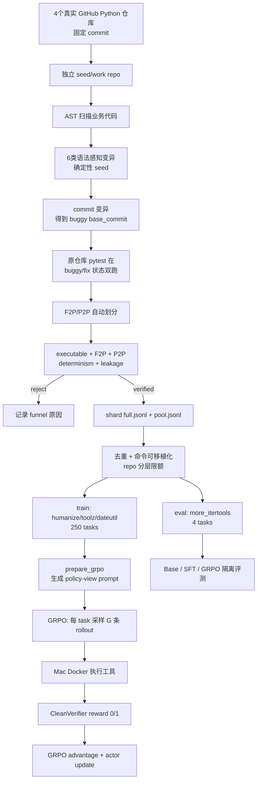

# SWE-Forge GRPO 训练数据构造与分布说明

> 当前数据版本：`rl_formal_v1/dataset_v1`  
> 状态日期：2026-08-10  
> AutoDL 项目：`/root/autodl-tmp/SWE_project`  
> AutoDL 实验根目录：`/root/autodl-tmp/experiments/rl_formal_v1`  
> 配套手册：《SWE-Forge 训练实验全流程手册》

## 1. 文档目的

本文只说明 GRPO 阶段所用的工程任务数据，包括：

- 数据来自哪些 GitHub 仓库；
- 最终 train/eval 数量和分布；
- 一条 Coding Agent RL 任务的数据结构；
- 候选 bug 如何从真实代码构造；
- F2P/P2P、去重、泄漏检查和仓库隔离如何工作；
- 数据何时离线构造，何时被 GRPO 在线消费。

这里的“GRPO 训练数据”不是普通的问答对，而是一组可以在隔离环境中执行和验证的代码修复任务。

## 2. 先明确：GRPO 中有两种不同的“数据”

### 2.1 离线任务数据（task pool）

训练前提前构造并冻结，每条数据定义一道可执行的 Coding Agent 任务：

```text
仓库和 buggy commit
+ Issue/任务描述
+ 环境安装命令
+ 测试执行命令
+ F2P 目标测试
+ P2P 回归测试
+ verifier 私有信息
```

当前冻结任务池为 `dataset_v1`。GRPO 训练过程不会自动访问 GitHub 重新出题。

### 2.2 在线轨迹数据（rollout）

GRPO 训练时，当前策略会对从 task pool 中抽到的任务进行多次采样，产生：

```text
prompt
  → tool_call
  → bash/search/view_file/str_replace
  → Docker observation
  → 继续工具调用
  → finish
  → CleanVerifier reward
```

这些轨迹由训练时的当前模型在线生成。因此：

- 任务是离线构造的；
- 解题轨迹是 GRPO 在线生成的；
- GRPO 自动生成 rollout，但不自动生成新 task；
- 数据飞轮是一个显式的外层流程，不嵌在单个 GRPO step 内。

## 3. 当前数据集快照

### 3.0 当前 RL 数据配方（recipe v1）

`dataset_v1` 的数据配方不是一个单独的比例参数，而是“来源选择 + 变异策略 + 可执行门槛 + 拆分策略 + 限额策略”的组合：

| 配方维度 | `dataset_v1` 实际设置 | 目的 |
|---|---|---|
| 仓库来源 | 4 个真实、依赖可控的 Python 开源库 | 避免只在一个 demo 仓库上训练 |
| 版本策略 | 每个仓库固定 commit | 保证源码、测试和变异点可复现 |
| 任务来源 | 本轮 100% `AST_MUTATION` | 稳定批量构造可验证 bug |
| 变异类型 | 6 类语法感知变异 | 覆盖条件、运算符、常量、赋值、分支和异常 |
| 变异粒度 | 单点局部修改，每任务一个 buggy commit | 降低 diff 噪声，保持可解释性 |
| 测试来源 | 原 GitHub 仓库真实 pytest | 不使用 LLM 自由编造的验证器 |
| 可执行门槛 | compile + executable + F2P + P2P + determinism + leakage | 拒绝等价、过激、超时和泄漏任务 |
| 去重 identity | `(repo, kind, file, location)` | 删除不同 seed/shard 命中的同一变异点 |
| 训练规模 | 唯一候选 255 条，分层限额到 250 条 | 控制首轮 GRPO 成本 |
| 训练仓库 | `humanize + toolz + python_dateutil` | 学习多仓库修复策略 |
| 评测仓库 | `more_itertools` 整仓 holdout | 检验跨仓库泛化，防止近重复泄漏 |
| policy 安全视图 | 不给模型 gold patch、mutation 位置和隐藏测试 | 防止答案泄漏 |

从“实际进入 GRPO 训练的任务概率”看，当前配方是：

```text
humanize        103 / 250 = 41.2%
toolz            98 / 250 = 39.2%
python_dateutil  49 / 250 = 19.6%
```

这是“候选通过率 + 去重 + 分层限额”共同得到的实际配方，不是手工指定一个 4:4:2 后强行复制数据。

### 3.1 最终数量

| Split | 仓库 | 任务数 | 占训练集比例 | 用途 |
|---|---|---:|---:|---|
| train | `humanize` | 103 | 41.2% | GRPO 任务采样 |
| train | `toolz` | 98 | 39.2% | GRPO 任务采样 |
| train | `python_dateutil` | 49 | 19.6% | GRPO 任务采样 |
| eval | `more_itertools` | 4 | — | 仓库隔离 holdout |
| **合计** | 4 个 GitHub 仓库 | **254** | — | train 250 + eval 4 |

当前 GRPO 正式训练使用 250 条 train task，不使用 4 条 eval task。

### 3.2 为什么 `more_itertools` 不混入训练

`more_itertools` 被整个仓库留作 eval，用来检验模型是否能把修复能力迁移到训练时没看到过的仓库。

这比随机将同一仓库的近似变异拆到 train/eval 更严格，可以减少以下泄漏：

- 同一业务函数上的不同变异跨 split；
- 同一测试集和项目结构跨 split；
- 模型记住仓库局部模式，却被当作工程泛化。

**注意：**4 条 eval 任务足以验收评测链路和发现明显回归，但不足以支撑稳健的统计结论。正式对外报告 Base/SFT/GRPO 提升前，建议将 repo-isolated eval 扩展到至少 20～50 条。

### 3.3 变异类型分布

#### Train（250 条）

| AST 变异类型 | 数量 | 含义 |
|---|---:|---|
| `operator_mutation` | 63 | `+/-`、`*/`、比较运算符等替换 |
| `constant_mutation` | 53 | 边界值、倍率或数值常量替换 |
| `invert_condition` | 49 | 对 `if` 条件取反 |
| `remove_assignment` | 39 | 删除单行赋值 |
| `remove_conditional` | 36 | 删除无 `else` 的条件块 |
| `exception_wrapper` | 10 | 异常类型替换 |

#### Eval（4 条）

| AST 变异类型 | 数量 |
|---|---:|
| `exception_wrapper` | 2 |
| `invert_condition` | 1 |
| `remove_conditional` | 1 |

### 3.4 每个仓库内部的变异分布

| 仓库 | invert | operator | constant | remove-if | remove-assign | exception | 合计 |
|---|---:|---:|---:|---:|---:|---:|---:|
| `humanize` | 25 | 23 | 32 | 12 | 11 | 0 | 103 |
| `toolz` | 20 | 19 | 14 | 21 | 15 | 9 | 98 |
| `python_dateutil` | 4 | 21 | 7 | 3 | 13 | 1 | 49 |
| `more_itertools` eval | 1 | 0 | 0 | 1 | 0 | 2 | 4 |

这个分布不是先硬编配额再生成，而是从各仓库可编译、可触发真实测试且通过 verifier 的候选中筛选得到。因此不同仓库中的变异构成不会完全相同。

### 3.5 F2P/P2P 规模

| 仓库 | F2P 特征 | P2P 数量范围 | 平均 P2P |
|---|---|---:|---:|
| `humanize` | 89 条任务有1个 F2P，最多3个 | 11～13 | 12.9 |
| `python_dateutil` | 主要1～3个 F2P，最多4个 | 8～11 | 10.3 |
| `toolz` | 主要1～3个 F2P，有一条26个 | 130～155 | 154.2 |
| `more_itertools` eval | 1～7个 F2P | 136～142 | 140.2 |

P2P 数量差异主要来自仓库测试规模，不代表 P2P 越多任务一定越难。

## 4. 数据来源与固定版本

| 本地名称 | GitHub 来源 | 固定 commit |
|---|---|---|
| `humanize` | `https://github.com/jmoiron/humanize.git` | `87dfb1c03f206f01bb9b597b1e290d72f467df9a` |
| `toolz` | `https://github.com/pytoolz/toolz.git` | `568c2b8393973cd172a466546c9d95779c452438` |
| `python_dateutil` | `https://github.com/dateutil/dateutil.git` | `48bd1af97e71baf8e96fce5b663d589caac8f147` |
| `more_itertools` | `https://github.com/more-itertools/more-itertools.git` | `7ff676d95968fb0a85f2527056c575cba039303c` |

服务器上的源仓库位于：

```text
/root/autodl-tmp/experiments/rl_formal_v1/upstream/
├── humanize/
├── toolz/
├── python_dateutil/
└── more_itertools/
```

项目中的软链接：

```text
/root/autodl-tmp/SWE_project/data/rl/source_repos
  -> /root/autodl-tmp/experiments/rl_formal_v1/upstream
```

构造时不使用仓库的浮动 `main`/`master`，而是固定 commit，否则源码、测试和变异点都可能改变，无法复现同一任务。

## 5. 一条 GRPO 任务的数据结构

### 5.1 `TaskSpec` 核心字段

```json
{
  "task_id": "hum-v5-invert_condition-000",
  "repo": "humanize",
  "base_commit": "<buggy_commit>",
  "problem_statement": "在 humanize 上存在一个 bug……",
  "environment": {
    "setup_commands": ["python -m pip install --no-build-isolation --no-deps -e . -q"],
    "build_commands": [],
    "test_commands": {
      "<test_id>": ["python", "-m", "pytest", "-v", "--color=no", "<test_id>"]
    }
  },
  "fail_to_pass": [
    {"test_id": "tests/test_filesize.py::test_naturalsize", "kind": "fail_to_pass"}
  ],
  "pass_to_pass": [
    {"test_id": "tests/test_number.py::test_ordinal", "kind": "pass_to_pass"}
  ],
  "gold_patch": null,
  "mutation": null,
  "metadata": {
    "task_source": "AST_MUTATION",
    "generator_type": "ast:invert_condition"
  }
}
```

### 5.2 `full.jsonl` 与 `pool.jsonl`

| 视图 | 包含内容 | 用途 | 是否可给 policy |
|---|---|---|---|
| `full.jsonl` | 完整 TaskSpec + `gold_patch` + mutation 位置/类型/原始代码 | 数据溯源、验证、重放 | 否 |
| `pool.jsonl` | 任务和 verifier 所需结构，剔除 `gold_patch` 和 `mutation` | 任务池、环境服务、CleanVerifier | 不直接整行给 policy |
| GRPO policy view | 由 `prepare_grpo.py` 从 pool 构建的 prompt | 模型输入 | 是 |

`pool.jsonl` 仍需保留 F2P/P2P 结构供环境和 verifier 使用，但 `prepare_grpo.py` 构造模型 prompt 时会剔除 verifier-only 信息。模型不应看到：

```text
gold patch
mutation kind/location/original code
F2P/P2P 隐藏测试细节
其他可以直接推断答案的字段
```

## 6. 候选任务的构造逻辑

### 6.1 步骤 1：从真实仓库建立 seed repo

1. clone 真实 GitHub 仓库；
2. checkout 固定 commit；
3. 准备可复现的 Python 环境和测试子集；
4. 将基准源码作为 fix/reference 状态；
5. 每个 factory shard 在独立 work dir 中重建仓库，不直接修改 upstream 副本。

### 6.2 步骤 2：扫描可变异的业务代码

`SyntaxAwareMutator` 只扫描业务 Python 源码，排除：

```text
tests/
test/
.git/
__pycache__/
.pytest_cache/
```

代码通过 Python AST 定位候选节点，但在源码文本上做局部区间替换，不对整个文件执行 `ast.unparse`。这样可以保证 diff 足够小，避免格式化噪声。

当前实现六类变异：

```text
invert_condition
operator_mutation
constant_mutation
remove_conditional
remove_assignment
exception_wrapper
```

### 6.3 步骤 3：确定性选择变异点

候选点按 `(file, lineno, col_offset)` 排序，再由 `mutation_seed` 和类型内序号确定选中位置。

对同一个：

```text
repo commit + seed + mutation kind + coverage setting
```

应当产生同一个变异点。实际 `target_index`、`recipe_seed`、文件和位置都会记录在 full 版中。

`--coverage-gated` 可以先用测试收集被覆盖实体，只在被测试执行到的函数/类中变异。当前 toolz 正式 shard 使用该策略；humanize 和 python-dateutil 宽搜 shard 未强制开启，但后续仍必须通过真实测试门槛。

### 6.4 步骤 4：生成 buggy commit

对选中的 AST 节点：

1. 对源码做单点变异；
2. 立即使用 `ast.parse` 检查语法；
3. 语法无效则拒绝；
4. 语法有效则将变异后状态 commit 到工作仓库；
5. 该 commit 成为 TaskSpec 的 `base_commit`，也就是 Agent 开始解题时看到的 buggy 状态。

### 6.5 步骤 5：用真实测试自动划分 F2P/P2P

对同一批真实 pytest 用例，分别在 buggy 和 fix/reference 状态执行：

| buggy 状态 | fix 状态 | 分类 |
|---|---|---|
| fail | pass | F2P，修复目标 |
| pass | pass | P2P，回归保护 |
| timeout/unresolved | 任意 | 不作为有效 F2P |
| fail/skip | fail/skip | bad test，候选拒绝 |

这一步不手写新测试，而是从原仓库真实测试中自动识别被变异破坏的用例。

### 6.6 步骤 6：早期候选过滤

任意一项成立都拒绝候选：

- 变异后源码不可编译；
- 没有 F2P，即变异没有被测试观测到；
- 没有 P2P，即变异过于破坏性；
- fix/reference 状态下相关测试仍失败；
- 测试超时或无法解析；
- 变异 diff 无效或不能稳定重放。

### 6.7 步骤 7：verified 五道门槛

`verify_task` 对每条候选再执行：

1. **executable**：`setup_commands` 可以安装当前仓库；
2. **F2P**：buggy 状态下所有目标测试确实失败；
3. **P2P**：buggy 状态下所有回归测试仍通过；
4. **determinism**：抽样 P2P 重跑后结果一致；
5. **leakage**：剔除 `gold_patch`/`mutation` 后的 pool 版通过 schema 和卫生检查。

只有五道门槛全部通过的任务才写入 shard 的 `full.jsonl` 和 `pool.jsonl`。

### 6.8 步骤 8：合并、去重和限额

训练 shard 的原始通过量：

| 仓库 | shard verified 输入 | 按变异位置去重后 |
|---|---:|---:|
| `toolz` | 111 | 98 |
| `humanize` | 116 | 108 |
| `python_dateutil` | 61 | 49 |
| **合计** | **288** | **255** |

去重 identity 为：

```text
(repo, mutation kind, source file, source location)
```

合并阶段共删除 33 条重复任务，得到 255 条唯一训练任务。随后用确定性按仓库轮询的 `stratified_cap(max_train=250)` 删除 5 条，得到最终 250 条。

合并脚本同时执行：

- 校验 full/pool task_id 一致；
- 检查 pool 中不存在 `gold_patch` 和 `mutation`；
- 将生成机的 Python 绝对路径归一化为容器内可移植的 `python`；
- 拒绝 train/eval 仓库交集；
- 生成数量、仓库分布、变异分布和数据就绪标志。

## 7. 整体数据流



## 8. 当前数据的目录结构

```text
/root/autodl-tmp/experiments/rl_formal_v1/
├── upstream/                       # 4个固定commit的源仓库
├── seeds/                          # 数据工厂的seed repo
├── venvs/                          # 各仓库构造环境
├── preflight_v2/toolz/             # toolz预检shard
├── formal/
│   ├── toolz/{s06,s11,s16,s21}/
│   ├── humanize/broad-v5/
│   ├── python_dateutil/broad-v2/
│   └── more_itertools/targeted/{s265,s369,s193,s52}/
└── dataset_v1/
    ├── train/full.jsonl
    ├── train/pool.jsonl
    ├── eval/full.jsonl
    ├── eval/pool.jsonl
    ├── manifest.json
    └── verification_pytest.log
```

当前 `dataset_v1` 约 11 MB。数据量小的原因是这里保存的主要是 TaskSpec、commit 和测试索引，完整仓库源码通过 upstream/work repo 复用，不会在每条 JSON 中重复存储。

## 9. 复现构造流程

### 9.1 环境变量

```bash
cd /root/autodl-tmp/SWE_project

export PROJECT=/root/autodl-tmp/SWE_project
export EXPERIMENT=/root/autodl-tmp/experiments/rl_formal_v1
export PYTHON_BASE=/root/autodl-tmp/conda/envs/sweforge/bin/python
export PYTHONPATH="$PROJECT/src"
```

数据工厂不需要 GPU，可以在 CPU 服务器上执行。GPU 只在 SFT、rollout 模型推理和 GRPO actor update 阶段使用。

### 9.2 toolz shard

```bash
bash scripts/expand_rl_tasks_cpu.sh
```

该脚本并行执行 seed `6/11/16/21`，每个 seed 生成独立 shard，并启用 coverage gate。

### 9.3 humanize 宽搜

```bash
TARGET="$EXPERIMENT/formal/humanize/broad-v5"

PATH="$EXPERIMENT/venvs/hum-s01/bin:$PATH" \
PYTHONPATH=src \
"$EXPERIMENT/venvs/hum-s01/bin/python" \
  -m sweforge.data.factory.factory \
  --repo-name humanize \
  --seed-dir "$EXPERIMENT/seeds/humanize" \
  --work-dir "$TARGET/work" \
  --out-dir "$TARGET/out" \
  --prefix hum-v5 \
  --mutation-seed 0 \
  --n-per-kind 40 \
  --no-reversal \
  2>&1 | tee "$TARGET/factory.log"
```

本轮输出 116 条 verified 任务。

### 9.4 python-dateutil 宽搜

当前 `broad-v2` 使用 seed 0 起始的宽搜，输出 61 条 verified 任务。复现时应将日志与输出分片保存在：

```text
$EXPERIMENT/formal/python_dateutil/broad-v2/
├── factory.log
└── out/{full,pool}.jsonl
```

标准调用形式：

```bash
TARGET="$EXPERIMENT/formal/python_dateutil/broad-v2"

PATH="$EXPERIMENT/venvs/dateutil/bin:$PATH" \
PYTHONPATH=src \
"$EXPERIMENT/venvs/dateutil/bin/python" \
  -m sweforge.data.factory.factory \
  --repo-name python_dateutil \
  --seed-dir "$EXPERIMENT/seeds/python_dateutil_curated" \
  --work-dir "$TARGET/work" \
  --out-dir "$TARGET/out" \
  --prefix du-v2 \
  --mutation-seed 0 \
  --n-per-kind 70 \
  --no-reversal \
  2>&1 | tee "$TARGET/factory.log"
```

### 9.5 more-itertools 仓库隔离 eval

当前保留四个已验证 targeted shard：

```text
seed 265 → 1 task
seed 369 → 1 task
seed 193 → 1 task
seed 52  → 1 task
```

每个 seed 必须使用独立 target 目录，避免输出相互覆盖。

### 9.6 合并为 `dataset_v1`

```bash
PYTHONPATH=src python scripts/build_rl_pool_manifest.py \
  --train-full "$EXPERIMENT/preflight_v2/toolz/out/full.jsonl" \
  --train-full "$EXPERIMENT/formal/toolz/s06/out/full.jsonl" \
  --train-full "$EXPERIMENT/formal/toolz/s11/out/full.jsonl" \
  --train-full "$EXPERIMENT/formal/toolz/s16/out/full.jsonl" \
  --train-full "$EXPERIMENT/formal/toolz/s21/out/full.jsonl" \
  --train-full "$EXPERIMENT/formal/python_dateutil/broad-v2/out/full.jsonl" \
  --train-full "$EXPERIMENT/formal/humanize/broad-v5/out/full.jsonl" \
  --eval-full "$EXPERIMENT/formal/more_itertools/targeted/s265/out/full.jsonl" \
  --eval-full "$EXPERIMENT/formal/more_itertools/targeted/s369/out/full.jsonl" \
  --eval-full "$EXPERIMENT/formal/more_itertools/targeted/s193/out/full.jsonl" \
  --eval-full "$EXPERIMENT/formal/more_itertools/targeted/s52/out/full.jsonl" \
  --max-train 250 \
  --out-dir "$EXPERIMENT/dataset_v1"
```

预期 manifest 核心结果：

```json
{
  "train": {
    "count": 250,
    "duplicates_removed": 33,
    "capped_removed": 5
  },
  "eval": {
    "count": 4
  },
  "repo_overlap": [],
  "formal_scale_ready": true
}
```

## 10. 数据验收

### 10.1 数量和 manifest

```bash
wc -l \
  "$EXPERIMENT/dataset_v1/train/full.jsonl" \
  "$EXPERIMENT/dataset_v1/train/pool.jsonl" \
  "$EXPERIMENT/dataset_v1/eval/full.jsonl" \
  "$EXPERIMENT/dataset_v1/eval/pool.jsonl"

cat "$EXPERIMENT/dataset_v1/manifest.json"
```

预期：

```text
250 train/full.jsonl
250 train/pool.jsonl
4 eval/full.jsonl
4 eval/pool.jsonl
repo_overlap=[]
formal_scale_ready=true
```

### 10.2 代码回归测试

```bash
cd /root/autodl-tmp/SWE_project

PATH=/root/autodl-tmp/conda/envs/sweforge/bin:$PATH \
/root/autodl-tmp/conda/envs/sweforge/bin/python -m pytest -q \
  tests/test_data_factory.py \
  tests/test_mutation_enhance.py \
  tests/test_taskenv.py \
  tests/test_build_rl_pool_manifest.py
```

当前最新验收结果：

```text
46 passed, 1 warning in 168.92s
TEST_EXIT=0
```

完整日志：

```text
/root/autodl-tmp/experiments/rl_formal_v1/dataset_v1/verification_pytest.log
```

### 10.3 开训前仍要做的验收

上述任务已通过 AutoDL 侧 Git + pytest 的可执行门槛。正式 GRPO 前还应执行：

1. 从 train 三个仓库分层抽样；
2. 使用 Mac Remote Environment Backend 建立真实 Docker；
3. 重放 setup/test/export_patch/CleanVerifier；
4. 确认 Docker 侧 F2P/P2P 与 AutoDL 构造侧结论一致；
5. 剔除容器中不可重现或超时任务；
6. 重新生成 manifest/hash，再冻结为真正进入 GRPO 的版本。

这一步是下一阶段，不要把“AutoDL 侧 pytest verified”与“Mac clean Docker 全量 verified”混为一个概念。

## 11. GRPO 如何消费这 250 条任务

### 11.1 转换为 policy-view prompt

```bash
export RL_POOL="$EXPERIMENT/dataset_v1/train/pool.jsonl"
export RL_TRAIN_JSONL="$EXPERIMENT/dataset_v1/grpo_train.jsonl"

cd /root/autodl-tmp/SWE_project

PYTHONPATH=src python -m sweforge.data.rl.prepare_grpo \
  --pool "$RL_POOL" \
  --out "$RL_TRAIN_JSONL" \
  --max-tasks -1 \
  --seed 7

wc -l "$RL_TRAIN_JSONL"
```

预期行数为 250。任意 prompt 都不应包含 gold patch、mutation location 或隐藏测试。

### 11.2 参考采样参数下的数据消耗

计划起始配置：

```text
task batch B = 8
rollout per task G = 4
```

因此每个 GRPO update 会从任务池中抽 8 道题，并生成：

```text
8 tasks × 4 rollouts = 32 online trajectories
```

如果对 250 条 train task 做均匀随机采样，每次抽到各仓库的概率约为：

```text
humanize        41.2%
toolz           39.2%
python_dateutil 19.6%
```

当前数据层只保证整体仓库分布，不保证每个 mini-batch 严格分层。若实验时发现小仓库长期采样不足，再引入 repo-aware sampler；第一轮不必额外复杂化。

### 11.3 任务不会在一次 rollout 后被消耗

task pool 是可重复采样的。同一个 task 在不同 step 中可以再次出现，但 rollout 使用的是当前新策略，因此轨迹和成功率会变化。

实验中应记录：

```text
task_id
repo
checkpoint/global_step
rollout seed
reward
resolved/F2P/P2P/integrity
tool calls/turns/tokens
termination reason
environment error
```

否则无法区分“模型没学会”、“任务过难”和“环境执行失败”。

## 12. 数据飞轮与下一版任务池

### 12.1 `dataset_v1` 是否已经使用数据飞轮

**没有。**

`dataset_v1` 是根据预先设计的 recipe，用离线 DataFactory 一次性扩展、验证、去重和冻结得到的。它没有使用以下信息反向调整数据配方：

- GRPO 模型在各 repo 上的实际成功率；
- 不同 mutation kind 的实际 reward 分布；
- 工具调用失败、超时和 termination reason 统计；
- “全失败/部分可解/全成功”任务的比例；
- 当前策略的难度边界。

因此简历或面试中对当前版本应该说：

> 完成了多仓库可执行 RL 任务的离线构造、验证、去重和版本化；数据飞轮的 profiling/analytics/recipe controller 已有框架，但尚未使用正式 GRPO rollout 反馈生成 `dataset_v2`。

不应该说：

> `dataset_v1` 是由 GRPO 自动数据飞轮产生的。

### 12.2 当前已有哪些飞轮基础

项目已有 profiling、analytics、controller 和 recipe 权重更新骨架，可以对 rollout 结果按仓库、变异类型、成功率和失败类型分析。它当前的定位是：

```text
已具备飞轮控制面骨架
≠ 已完成一轮正式数据飞轮
≠ GRPO step 内自动造题
```

### 12.3 第一次真正数据飞轮的触发条件

至少完成一轮正式 GRPO，并且保存下列 task-level 指标后，才能基于真实模型行为调整 recipe：

```text
repo / mutation kind
reward / resolved
group reward variance
F2P / P2P / integrity
tool parse error / illegal call
turns / tokens / timeout
environment failure / termination reason
```

建议的 recipe 更新规则：

- 对成功率 0% 且原因是任务/环境缺陷的样本：修复或剔除；
- 对成功率长期 100% 的过易任务：降低采样权重；
- 对组内 reward 同时有 0/1 的部分可解任务：提高采样权重或增加 `G`；
- 对某个 repo/kind 的系统性短板：增加同类但不重复的候选；
- 所有新任务重新经过 pytest + Docker + CleanVerifier 门槛；
- eval repo 不参与飞轮数据回流。

当前 GRPO 不会边训边自动将失败 rollout 变成新任务。一轮训练后，显式执行：

```text
dataset_v1
  → GRPO rollout 统计
  → 按 repo/mutation/reward/termination 分析难度
  → 识别全失败、全成功和部分可解任务
  → 调整 seed、变异类型、仓库和难度权重
  → 离线生成新候选
  → pytest + Mac Docker 复验
  → 去重、人工抽检、版本化
  → dataset_v2
  → 下一轮 GRPO
```

飞轮阶段不应把 eval 仓库失败样本回流到 train，否则 `more_itertools` 不再是未见仓库 holdout。

## 13. 当前结论与使用边界

当前可以确认：

- 四个 GitHub 仓库都已进入整体实验数据；
- GRPO train 使用三个仓库的 250 条任务；
- `more_itertools` 保持仓库级隔离；
- 所有任务均来自真实仓库代码和真实测试；
- 当前任务由 AST mutation 构造，不是 LLM 自由编造 Issue；
- 训练集已完成去重、答案剔除和 train/eval repo 隔离；
- 当前完整相关回归测试为 46 passed；
- 任务工厂阶段不占 GPU；
- 下一个数据 Gate 是 Mac clean Docker 抽样/分层复验。

当前不应过度声称：

- 4 条 eval 已足以证明稳健的泛化提升；
- 任务已全部通过 Mac Docker 正式复验；
- GRPO 会自动扩展 GitHub 任务池；
- 当前数据同时包含大量真实历史 issue/reversal 任务。

本版数据的准确定位是：**以真实 GitHub Python 仓库和真实 pytest 为基础，通过确定性 AST 变异与可执行门槛构建的首轮多仓库 Coding Agent GRPO 任务池。**
