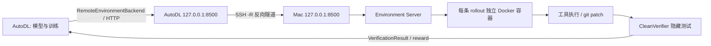

# SWE-Forge 环境搭建与两端联通手册

> 适用状态：阶段 18（SFT、正式多轮 AgentLoop、Mac Docker CleanVerifier、veRL GRPO 工程链路已接线）。  
> 目标：只完成“实验能启动之前”的环境准备与验收，不在本手册中启动正式 SFT/GRPO。  
> 两端代码位置：Mac `/Users/apple/code/SWE_project`；AutoDL `/root/autodl-tmp/SWE_project`。

## 1. 两端职责



- **AutoDL**：保存模型、SFT/RL数据和训练产物；运行 PyTorch、veRL、vLLM、FSDP、AgentLoop。
- **Mac**：运行 Docker、创建隔离 coding 环境、执行 bash/search/view/edit/finish、导出 patch、运行隐藏测试。
- **SSH 隧道**：由 Mac 主动连接 AutoDL，把 AutoDL 的 `127.0.0.1:8500` 转发到 Mac Environment Server。
- **安全边界**：Docker Server 只监听 Mac 的 `127.0.0.1`；容器使用非 root 用户、`--network none`，依赖必须预装在镜像中。

## 2. 哪些工作只做一次，哪些每次开机都做

| 类别 | 工作 | 频率 |
|---|---|---|
| 静态环境 | Mac Python环境、Colima/Docker、基础镜像 | 首次部署或依赖变化后 |
| 静态环境 | AutoDL conda环境、锁定依赖、模型缓存、项目代码 | 首次部署或服务器重装后 |
| 静态数据 | SFT规范化/tokenize数据、RL种子仓库、隐藏测试 | 数据版本变化后 |
| 每次开机 | 启动 Colima、Mac Environment Server | 每次Mac或Docker重启后 |
| 每次开机 | 建立 Mac → AutoDL 反向SSH隧道 | 每次AutoDL实例重启或地址变化后 |
| 每次实验 | health、interop、GPU/内存/磁盘、代码版本检查 | 每次SFT/GRPO前 |
| 每次RL | 确认任务池与评测集版本冻结 | 每个RL实验开始前 |

## 3. Mac 一次性环境准备

### 3.1 进入项目并确认 Python

```bash
cd /Users/apple/code/SWE_project
python --version
```

要求 Python 3.11 以上；本项目已使用 Python 3.12 验证。项目脚本通常不依赖 editable install，运行时显式设置：

```bash
export PYTHONPATH=src
```

### 3.2 启动并检查 Docker

```bash
colima status
colima start
docker info
```

当前验证环境约为 4 CPU / 8GB Colima VM。真实仓库测试会成为 RL rollout 的吞吐瓶颈，正式训练前不要盲目把 Agent Worker 开得很大。

### 3.3 构建基础镜像

```bash
cd /Users/apple/code/SWE_project
docker build -t sweforge-base src/sweforge/env_server/docker/
docker image inspect sweforge-base >/dev/null
```

预期：命令退出码为 0。

注意：容器运行时禁网。目标仓库所需的 Python/系统依赖必须已经存在于 `sweforge-base` 或任务指定的 `environment.image` 中，不能指望 rollout 时在线安装。

### 3.4 运行 Mac 侧测试

```bash
cd /Users/apple/code/SWE_project
NO_PROXY=127.0.0.1,localhost python -m pytest -q
```

验收标准：全部通过。Mac checkout 与 AutoDL checkout承担的模块不同，测试数量可能不同，不要只比较数字。

## 4. AutoDL 一次性环境准备

AutoDL 开机后先登录。主机、端口和用户名从 Mac 本地、不进入 Git 的文件读取：

```text
/Users/apple/code/SWE_project/AUTODL_SSH.txt
```

登录模板：

```bash
ssh -i ~/.ssh/autodl_ed25519 -p <SSH_PORT> root@<AUTODL_HOST>
```

### 4.1 检查项目与环境

```bash
cd /root/autodl-tmp/SWE_project
git status --short
git log -1 --oneline
/root/autodl-tmp/conda/envs/sweforge/bin/python --version
```

阶段18已验证提交为 `4d72c72`。若服务器升级后代码版本变化，以当前 `CLAUDE.md`、`git log` 和实际测试为准。

### 4.2 检查四卡与拓扑

```bash
nvidia-smi -L
nvidia-smi --query-gpu=index,name,memory.total,memory.used,memory.free --format=csv
nvidia-smi topo -m
```

四张4090应全部出现，每张约24GB。无NVLink是预期状态：SFT/Actor使用FSDP，rollout保持 `tensor_model_parallel_size=1`，避免逐token跨卡通信。

### 4.3 检查主机内存和磁盘

```bash
free -h
df -h / /root/autodl-tmp
```

建议：

- 主机可用内存至少128GB；当前实例此前实际识别约755GiB，总量足够。
- 正式实验前数据盘最好至少空余100GB。
- checkpoint只保留1～2份；优先保存/导出LoRA Adapter，避免重复的8.9GB全模型checkpoint。

### 4.4 设置运行环境

```bash
export PYTHONPATH=/root/autodl-tmp/SWE_project/src
export HF_HOME=/root/autodl-tmp/huggingface
export HF_ENDPOINT=https://hf-mirror.com
export PYTORCH_CUDA_ALLOC_CONF=expandable_segments:True
```

不要升级 torch、veRL、vLLM、transformers、CUDA相关包。阶段18基线依赖已锁定；已授权的历史例外只有 `tensordict 0.10.0` 与 `pyvers`。

### 4.5 运行 AutoDL 回归测试

```bash
cd /root/autodl-tmp/SWE_project
/root/autodl-tmp/conda/envs/sweforge/bin/python -m pytest tests/ -q
```

阶段18历史结果：

```text
369 passed
```

若只想先检查阶段18新增部分：

```bash
/root/autodl-tmp/conda/envs/sweforge/bin/python -m pytest \
  tests/test_verl_agent_loop.py \
  tests/test_export_lora.py \
  tests/test_prepare_grpo.py \
  tests/test_sft_engineering.py -q
```

历史结果：`42 passed`。

## 5. 每次开机后的两端联通

顺序必须是：Mac Docker → Mac Server → 反向隧道 → AutoDL health → interop。

### 5.1 Mac终端1：启动Environment Server

```bash
cd /Users/apple/code/SWE_project
NO_PROXY=127.0.0.1,localhost PYTHONPATH=src \
python -m sweforge.env_server.server \
  --bundles-dir examples \
  --docker \
  --cleanup-stale 3600 \
  --port 8500
```

保持终端运行。预期包含：

```text
Mac Environment Server: backend=...
Uvicorn running on http://127.0.0.1:8500
```

另开终端自检：

```bash
curl --noproxy '*' -sS http://127.0.0.1:8500/health
```

预期：

```json
{"ok":true}
```

默认不要启用 `--token`，因为AutoDL当前正式 `RemoteEnvironmentBackend` 默认不发送认证头。只有两端同时配置认证时才启用。

### 5.2 Mac终端2：建立反向隧道

先从 `AUTODL_SSH.txt` 取得当前主机和端口，然后执行：

```bash
ssh -o BatchMode=yes \
  -o ExitOnForwardFailure=yes \
  -o ServerAliveInterval=30 \
  -o ServerAliveCountMax=3 \
  -N -R 8500:127.0.0.1:8500 \
  -i ~/.ssh/autodl_ed25519 \
  -p <SSH_PORT> root@<AUTODL_HOST>
```

该终端没有持续输出是正常的，但必须保持连接。AutoDL关机、重装或SSH入口变化后要重新建立。

### 5.3 AutoDL：验证隧道

```bash
curl --noproxy '*' -sS --max-time 5 http://127.0.0.1:8500/health
```

预期：

```json
{"ok":true}
```

若返回 `Connection refused`，说明反向隧道未建立或已断开；不要用Mock环境继续冒充正式RL。

### 5.4 AutoDL：运行完整协议联调

```bash
cd /root/autodl-tmp/SWE_project
PYTHONPATH=src /root/autodl-tmp/conda/envs/sweforge/bin/python \
  scripts/interop_mac.py --base-url http://127.0.0.1:8500
```

预期关键输出：

```text
[1/7] health              OK
[2/7] register_task       OK
[3/7] create              OK
[4/7] 五工具逐条          OK
[5/7] export_patch        OK
[6/7] verify              OK (verdict=resolved)
[7/7] agent loop          OK
联调通过
```

Mac Server日志应同时出现：

```text
POST /v1/envs ... 200 OK
POST /v1/envs/<id>/actions ... 200 OK
GET  /v1/envs/<id>/patch ... 200 OK
POST /v1/verifications ... 200 OK
DELETE /v1/envs/<id> ... 200 OK
```

## 6. 实验前的最终验收清单

在启动任何SFT或GRPO前逐项确认：

- [ ] Mac `docker info` 正常，`sweforge-base`存在。
- [ ] Mac `/health` 返回 `{"ok":true}`。
- [ ] AutoDL经隧道访问 `/health` 成功。
- [ ] `interop_mac.py` 7/7通过。
- [ ] `docker ps -a --filter label=sweforge.managed=true`没有异常遗留容器。
- [ ] 四张GPU均可见，无其他训练进程占用显存。
- [ ] `/root/autodl-tmp`空间满足本轮checkpoint策略。
- [ ] `git status --short`已核对，知道本轮使用的commit。
- [ ] SFT/RL输入文件存在并记录了样本数、hash和拆分方式。
- [ ] RL评测集已按repo/commit隔离，训练开始后不再修改。
- [ ] 输出目录使用新实验名，避免覆盖旧日志。

## 7. 常见故障

### AutoDL health失败

检查顺序：Mac Server是否在运行 → Mac本机health → SSH隧道是否存活 → AutoDL health。

### Docker任务setup失败

容器默认禁网。把依赖预装到镜像，或者为任务指定已经构建好的 `environment.image`。

### 出现残留容器

先查看：

```bash
docker ps -a --filter label=sweforge.managed=true
```

优先通过 Server 的 `--cleanup-stale 3600` 清理历史容器，不要使用针对整个Docker环境的宽泛删除命令。

### AutoDL训练正常但Mac没有请求日志

这通常意味着运行的是Mock/格式奖励脚本，而不是正式 `sweforge_verifier` AgentLoop。检查：

```text
actor_rollout_ref.rollout.agent.default_agent_loop=sweforge_verifier
agent_loop_config_path=configs/agent_loops.yaml
```

### 服务器升级后四卡只识别一张

先停止实验，检查AutoDL实例配置、`nvidia-smi -L`、容器GPU映射和torch可见设备。不要先从训练参数层面绕过硬件识别问题。

## 8. 下一份手册

环境与联通全部通过后，再按照《SWE-Forge 训练实验全流程手册》执行数据准备、SFT、Adapter验证、RL任务扩展、GRPO、评测和数据飞轮。
