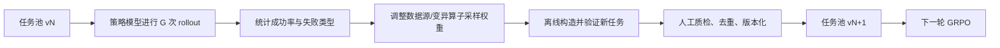
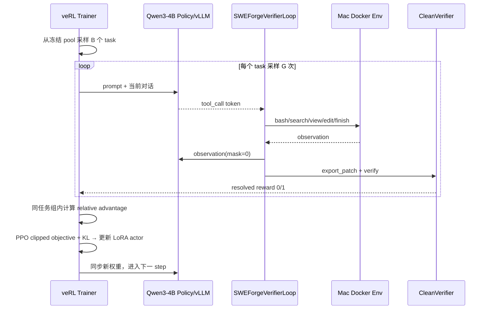
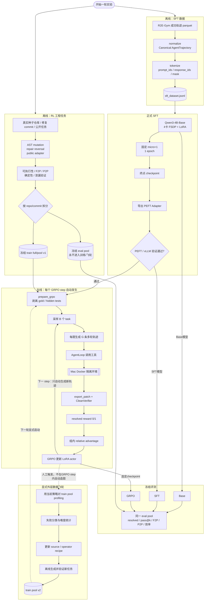

# SWE-Forge 训练实验全流程手册

> 适用状态：阶段 18。当前已打通 `SFT → 多轮 AgentLoop → Mac Docker → CleanVerifier → GRPO 单步更新` 的真实链路；正式 4B、多卡、规模化实验尚未执行。  
> AutoDL 项目：`/root/autodl-tmp/SWE_project`；Mac Docker 服务：`/Users/apple/code/SWE_project`。  
> 使用方法：先完成《SWE-Forge 环境搭建与两端联通手册》，再按本文顺序操作。

## 1. 先回答最容易混淆的三个问题

### 1.1 RL 到底需不需要“数据”

需要，但要区分两类数据：

1. **任务数据（task pool）**：在训练前离线构造。每条任务包含仓库快照、Issue、环境配置和隐藏测试。这是 Agent 要解决的题目。
2. **轨迹数据（rollout）**：GRPO 训练时在线产生。同一个任务会被当前策略采样 `G` 次，形成多条“模型输出 → 工具调用 → 环境反馈”轨迹。

GRPO 每一步自动产生的是**轨迹**，不是新的 GitHub 任务。

### 1.2 RL 任务扩展是不是训练时自动完成

**不是。当前实现中，任务扩展是与 GRPO 解耦的离线阶段。**正确顺序是：

```text
种子仓库/公开任务
  → AST 变异、历史修复反转、公开任务导入
  → Docker 回放与 CleanVerifier 筛选
  → 冻结 train pool / eval pool
  → prepare_grpo 剥离答案和隐藏测试
  → GRPO 在线采样轨迹并更新模型
```

必须先准备足够大的、验证通过的任务池，再开始一轮正式 RL。当前约 7 条 demo 任务只够联通测试，不够形成有意义的训练结论。

### 1.3 RL 会不会自动运行“数据飞轮”

**不会自动运行完整飞轮。**当前 `run_grpo_agentic.sh` 会从冻结任务池采样任务并在线 rollout，但不会在每个 step 自动访问 GitHub、生成新 Issue、注入新 bug 或扩充任务池。

当前飞轮是一个需要显式触发的**外层循环**：



`scripts/run_flywheel_round.py` 已能执行 profiling、analytics、controller 和 recipe 权重更新；默认是 dry-run。**重新造题、Docker 验证、合并新任务以及启动下一轮训练仍是显式步骤。**这样更可控，也避免训练过程中任务分布悄悄变化，导致实验不可复现。

## 2. 整个项目如何组织

### 2.1 四个核心模块

| 模块 | 输入 | 主要代码 | 输出 |
|---|---|---|---|
| 工程任务构造 | 种子仓库、历史修复、公开任务 | `src/sweforge/data/factory/`、`src/sweforge/data/public/` | full task、policy task、任务池与数据报告 |
| SFT 后训练 | 工具调用示范轨迹 | `src/sweforge/data/sft/`、`scripts/smoke_sft.py`、`scripts/sft_lora_entry.py` | Qwen3-4B LoRA Adapter |
| Coding Agent Rollout | policy task、当前模型 | `src/sweforge/rollout/verl_agent_loop.py`、Mac Environment Server | 多轮 token、mask、工具 observation、patch |
| 可验证 RL 与评测 | rollout、CleanVerifier 结果 | `scripts/run_grpo_agentic.sh`、veRL、评测/飞轮模块 | GRPO 更新、checkpoint、指标与下一轮配方 |

### 2.2 哪些是结构建设，哪些必须串起来

| 类型 | 工作 | 依赖关系 |
|---|---|---|
| 一次性结构 | Docker 环境协议、五类工具、AgentLoop、CleanVerifier、SFT/GRPO launcher | 已基本完成；代码/协议变化时重验 |
| 可独立并行 | 扩展训练任务、整理 SFT 数据、构建 Docker 镜像、准备评测任务 | 彼此可并行，但都要在正式实验前冻结版本 |
| 必须串行 | SFT → 导出 Adapter → Adapter 验证 → GRPO 初始化 | 后一步依赖前一步产物 |
| 每个 GRPO step 内耦合 | 采样任务 → G 条 rollout → Docker 执行 → verifier 奖励 → 组内 advantage → actor 更新 | 必须是同一个训练 step 的闭环 |
| 每轮外循环 | 本轮策略 profiling → 失败分析 → 数据配方更新 → 新任务池 → 下一轮 RL | 不应嵌入单个 GRPO step |
| 独立评测 | Base/SFT/GRPO 在冻结 holdout 上比较 | 评测集不得进入训练或飞轮 |

### 2.3 当前代码的完成边界

已经实现并验证：

- SFT 启动、LoRA checkpoint 导出、PEFT/vLLM Adapter 有效性验证。
- veRL 正式多轮 AgentLoop；模型 token 与 observation mask 对齐。
- bash、search、view_file、str_replace、finish 五类工具。
- Mac Docker 独立环境、patch 导出、CleanVerifier 隐藏测试与二值 reward。
- 真实环境上的 0.6B、1-step GRPO 更新链路。
- 离线任务工厂、profiling、analytics 和飞轮 recipe 更新骨架。

正式实验前仍需完成：

- 服务器升级后验证 4×4090、FSDP FULL_SHARD 和四卡稳定性。
- 避开旧 launcher 的动态 batch：`use_dynamic_bsz=True` 时 `micro_batch_size` 不构成显存硬上限；本文正式命令直接以 Hydra override 设为 `False`，并在四卡上验证固定 micro-batch。
- 当前 `run_grpo_agentic.sh` 是单卡 smoke launcher；正式 4 卡前需把 `nproc_per_node`、`trainer.n_gpus_per_node` 等变成一致的多卡参数。
- 将 RL 任务池从 demo 7 条扩到至少 100～250 条验证通过任务。
- 固定 repo/commit 隔离的正式评测集。脚本当前自动抽出的 val 不能代替正式 holdout。
- 当前主奖励是 `resolved ∈ {0,1}`。简历中若写复合奖励，必须先实现并做消融，不能把设计稿当成现有结果。
- 一次真实有效的梯度验收：`tool_calls > 0`、组内 reward 同时有 0/1、advantage/grad_norm/pg_loss 非零。

### 2.4 手动执行时的严格顺序

单人操作时按以下 Gate 推进；上一 Gate 未通过，不进入下一步：

```text
Gate 1  核对/构造 SFT 数据
  ↓
Gate 2  正式 SFT 1 epoch
  ↓
Gate 3  Adapter 导出并证明不是空壳
  ↓
Gate 4  先冻结 RL holdout，再离线扩训练任务池
  ↓
Gate 5  把完整训练池转成 policy-view GRPO JSONL
  ↓
Gate 6  真实闭环验收 → 4B有效梯度验收 → 正式 GRPO
  ↓
Gate 7  Base / SFT / GRPO 同条件评测
  ↓
Gate 8  飞轮分析 → 显式构造 pool v2 → 下一轮 GRPO
```

SFT 训练与 RL 任务构造在工程上可以并行；本文为了方便手动操作，采用先完成 SFT、再冻结并扩展 RL pool 的串行顺序。

## 3. 一次完整实验的目录与版本约定

AutoDL 开机后：

```bash
cd /root/autodl-tmp/SWE_project
export PYTHONPATH=/root/autodl-tmp/SWE_project/src
export HF_HOME=/root/autodl-tmp/huggingface
export PYTORCH_CUDA_ALLOC_CONF=expandable_segments:True
```

为本轮实验设置名字。模型已在 Hugging Face 缓存时可直接使用模型 ID；RL v1 路径由后面的任务扩展阶段创建：

```bash
export EXP_NAME=sweforge_qwen3_4b_r1
export MODEL_PATH=Qwen/Qwen3-4B-Base
export SFT_DATA=/root/autodl-tmp/SWE_project/data/r2egym/sft_dataset.jsonl
export SFT_OUT=/root/autodl-tmp/experiments/${EXP_NAME}/sft
export RL_POOL=/root/autodl-tmp/SWE_project/data/rl/v1/train/pool.jsonl
export RL_EVAL_POOL=/root/autodl-tmp/SWE_project/data/rl/v1/eval/pool.jsonl
export RL_OUT=/root/autodl-tmp/experiments/${EXP_NAME}/grpo
```

SFT 完成后再把 `ADAPTER_PATH` 指向实际 step：

```bash
export ADAPTER_PATH="$SFT_OUT/checkpoints/global_step_<实际步数>/adapter"
```

建议每个实验目录只包含：

```text
experiments/<EXP_NAME>/
├── manifest.txt          # commit、数据hash、模型、完整命令、GPU信息
├── sft/
│   ├── train.log
│   └── adapter/          # 最终保留的LoRA Adapter
├── grpo/
│   ├── train.log
│   └── checkpoints/      # 只保留最近1～2份
└── eval/
    ├── base.jsonl
    ├── sft.jsonl
    └── grpo.jsonl
```

开始前记录版本：

```bash
mkdir -p /root/autodl-tmp/experiments/${EXP_NAME}
git rev-parse HEAD
sha256sum "$SFT_DATA" "$RL_POOL" "$RL_EVAL_POOL"
nvidia-smi -L
```

把输出连同实际命令复制到 `manifest.txt`。不要把评测集的隐藏测试写进训练 prompt 或日志。

## 4. 阶段 A：准备并冻结 SFT 数据

### 4.1 数据形态

SFT 学习的不是单轮问答，而是成功的 Coding Agent 工具轨迹，例如：

```text
system: 工具协议与工作规则
user: Issue 描述
assistant: <tool_call>{"name":"search", ...}</tool_call>
tool: <tool_response>...</tool_response>
assistant: <tool_call>{"name":"view_file", ...}</tool_call>
tool: <tool_response>...</tool_response>
assistant: <tool_call>{"name":"str_replace", ...}</tool_call>
tool: <tool_response>...</tool_response>
assistant: <tool_call>{"name":"bash", "command":"pytest ..."}</tool_call>
tool: <tool_response>...</tool_response>
assistant: <tool_call>{"name":"finish", ...}</tool_call>
```

当前数据统计曾为：raw 3231 条、成功轨迹 3134 条、规范化/tokenized 3061 条。不同最大长度下保留数量不同：8192 约 2306 条、7000 约 1836 条、4096 仅约 284 条。因此正式 SFT 建议使用 8192，而不是为省显存直接截到 4096 丢掉大部分长链样本。

### 4.2 先确认现有 SFT 数据，再决定是否重建

服务器当前已有：

```text
data/r2egym/sft-trajectories.parquet                 3231条原始轨迹
data/r2egym/normalized/trajectories.jsonl            3061条规范化轨迹
data/r2egym/sft_dataset.jsonl                        3061条预tokenize数据
data/r2egym/sft_tokenize_report.json                 tokenize报告
```

因此第一轮实验可以直接使用：

```bash
export SFT_DATA=/root/autodl-tmp/SWE_project/data/r2egym/sft_dataset.jsonl
wc -l "$SFT_DATA"
```

预期：

```text
3061 .../data/r2egym/sft_dataset.jsonl
```

只有更换原始数据、消息模板或 tokenizer 时才重新构建。正式重建命令为：

```bash
PYTHONPATH=src python -m sweforge.data.sft.normalize \
  --source data/r2egym/sft-trajectories.parquet \
  --out data/r2egym/normalized \
  --tokenizer "$MODEL_PATH"

PYTHONPATH=src python -m sweforge.data.sft.tokenize \
  --source data/r2egym/normalized/trajectories.jsonl \
  --out data/r2egym/sft_dataset.jsonl \
  --tokenizer "$MODEL_PATH"
```

默认会自动计算 generation prompt 的 prefix mask，使 SFT 的 mask 语义与 veRL 生成阶段一致；不要随意改成 `--no-generation-prefix-mask`。

数据验收至少包括：

- 每条样本都能被 schema 读取。
- tool call 与 tool response 成对，终态明确。
- 不包含 verifier 隐藏测试、gold patch 等策略不可见信息。
- 统计 token 长度分布和截断率。
- 训练/验证拆分固定且有 seed。

示例输出是统计信息，不要求文案完全一致：

```text
raw=3231 successful=3134 normalized=3061
max_length=8192 retained=2306 dropped=755
```

## 5. 阶段 B：SFT 训练与 Adapter 验证

### 5.1 正式 SFT 参考参数

| 参数 | 4×4090 起始值 | 说明 |
|---|---:|---|
| 模型 | Qwen3-4B-Base | Base 更能体现 SFT 对工具格式的学习 |
| 精度 | bf16 | 4090 支持 |
| LoRA rank / alpha | 16 / 32 | 第一轮够用；不先追求大 rank |
| max length | 8192 | 保留约 2306 条长轨迹 |
| global train batch | 32 | 4 卡起始值 |
| fixed micro batch | 每卡 1 | 正式命令直接设置 `data.use_dynamic_bsz=False` |
| learning rate | `1e-4` | 可与 `2e-4` 做小规模对比 |
| warmup ratio | 0.03～0.05 | 当前默认 0.03 |
| epoch | 1 | 先训练 1 epoch，不以“训练到完全收敛”为目标 |
| save | 只在末尾 | 保留 Adapter，避免周期性全量 ckpt 峰值 |
| keep | 1～2 | 控制数据盘占用 |

若 8192 长度、global batch 32、约 2306 条样本，则 1 epoch 大约：

```text
ceil(2306 / 32) ≈ 73 optimizer steps
```

### 5.2 正式四卡训练命令

`scripts/smoke_sft.py` 虽然内部调用的也是真实 veRL SFT Trainer，但名称和默认参数用于工程试跑。正式实验直接调用 `scripts/sft_lora_entry.py`，避免把 smoke 配置混入正式结果。

先建立输出目录：

```bash
mkdir -p "$SFT_OUT"
set -o pipefail
```

正式命令如下。它使用 4 卡 FSDP、固定每卡 micro batch 1、训练 1 epoch、仅在终点保存并自动导出 Adapter：

```bash
SWEFORGE_SFT_ADAPTER_ONLY=1 \
PYTHONPATH=src \
PYTORCH_CUDA_ALLOC_CONF=expandable_segments:True \
/root/autodl-tmp/conda/envs/sweforge/bin/python -m torch.distributed.run \
  --nproc_per_node=4 --nnodes=1 \
  scripts/sft_lora_entry.py --config-name sft_trainer_engine \
  "model.path=$MODEL_PATH" \
  +model.override_config.attn_implementation=sdpa \
  "data.train_files=$SFT_DATA" \
  data.custom_cls.path=pkg://sweforge.training.sft.dataset \
  data.custom_cls.name=SFTTrajectoryDataset \
  data.train_batch_size=32 \
  data.micro_batch_size_per_gpu=1 \
  data.max_token_len_per_gpu=8192 \
  data.max_length=8192 \
  data.use_dynamic_bsz=False \
  model.lora_rank=16 \
  model.lora_alpha=32 \
  engine.model_dtype=bfloat16 \
  engine.use_torch_compile=False \
  trainer.project_name=sweforge \
  trainer.experiment_name=sft-qwen3-4b-r16-1ep \
  "trainer.default_local_dir=$SFT_OUT/checkpoints" \
  trainer.total_training_steps=100000 \
  trainer.total_epochs=1 \
  trainer.logger='[console]' \
  trainer.seed=1 \
  trainer.resume_mode=disable \
  trainer.save_freq=100000 \
  trainer.max_ckpt_to_keep=1 \
  trainer.test_freq=-1 \
  trainer.device=cuda \
  trainer.nnodes=1 \
  trainer.n_gpus_per_node=4 \
  checkpoint.save_contents='[model]' \
  optim.lr=0.0001 \
  optim.lr_warmup_steps_ratio=0.03 \
  2>&1 | tee "$SFT_OUT/train.log"
```

注意：

- `trainer.total_training_steps=100000` 是宽松上限，`trainer.total_epochs=1` 会先结束，因此实际只跑 1 epoch。
- `trainer.save_freq=100000` 避免中间保存；veRL 最后一步仍会保存，`SWEFORGE_SFT_ADAPTER_ONLY=1` 随后自动导出 Adapter 并删除大 `.pt`。
- 当前 `scripts/run_sft.sh` 仍是旧的一卡、动态 batch、2 epoch 配置，不要原样用于升级后的正式实验。
- 正式命令显式使用 `data.use_dynamic_bsz=False`。这样 `micro_batch_size_per_gpu=1` 才真正限制每卡单次前后向样本数。
- shell 的 `\` 续行之间不能插空行或注释。阶段18曾因此静默丢失后半段 Hydra 参数。
- 一卡 24GB 时，FSDP 退化为 `NO_SHARD`，此前峰值约 22.24GB，保存附近 OOM；减小 micro batch 无法消除参数/梯度/优化器/状态聚合产生的固定显存。四卡 FULL_SHARD 能解决容量问题，无 NVLink 主要影响速度，不改变可行性。

示例日志关注这些字段：

```text
global_step: 1/73
loss: <finite>
grad_norm: <finite>
lr: 0.0001
...
global_step: 73/73
adapter export completed
```

不要预设 loss 必须降到某个绝对值。判断是否继续第二个 epoch，应看留出轨迹上的工具格式合法率、Agent 环境成功率是否还在提升；第一轮建议只做 1 epoch，避免把 SFT 当成记忆训练集。

训练成功后，预期 Adapter 位于：

```text
$SFT_OUT/checkpoints/global_step_<N>/adapter/
```

### 5.3 单独导出 Adapter（自动导出失败或需要保留 checkpoint 时）

```bash
PYTHONPATH=src python -m sweforge.training.sft.export_lora \
  <FSDP_CHECKPOINT目录> \
  --out "$ADAPTER_PATH" \
  --base-model "$MODEL_PATH" \
  --verify \
  --device cuda:0
```

预期输出目录至少包含：

```text
adapter_model.safetensors
adapter_config.json
config.json
tokenizer.json
```

### 5.4 验证 Adapter 不是空壳

```bash
PYTHONPATH=src python scripts/verify_adapter_vllm.py \
  --adapter "$ADAPTER_PATH" \
  --base "$MODEL_PATH" \
  --cuda
```

验收：

```text
adapter_model.safetensors存在且非零
vLLM成功接受LoRARequest
生成文本非空，打印adapter采样logprob
```

单卡 24GB 不要使用同时驻留两个引擎的 baseline 对比；当前验证脚本应使用单引擎 + `LoRARequest`。

## 6. 阶段 C：离线扩展并冻结 RL 任务池

### 6.1 目标规模与拆分原则

第一轮正式实验建议：

- 选择 3～5 个依赖可控、测试可复现的 Python 仓库。
- 生成 300～600 条候选。
- Docker 回放后保留 100～250 条有效训练任务。
- 另建 repo/commit 隔离的 holdout；同一 bug 的近重复版本不能跨 train/eval。

服务器当前只有 `data/factory/out/pool.jsonl` 的 7 条 demo 任务，以及 `data/public/r2e_gym_lite_sample.jsonl` 的 16 条公开样本；它们用于开发/验收，不能直接当作正式 100～250 条训练池。

评测集要**先冻结**，然后才扩训练池。否则飞轮很容易把评测信息带回训练集。

### 6.2 三类任务来源

| 来源 | 做法 | 价值 | 风险 |
|---|---|---|---|
| AST mutation | 对真实代码实施受控语法/语义变异 | 规模稳定、容易控制难度 | 可能过于模板化 |
| repair reversal | 从历史修复 commit 反推故障版本 | 更接近真实工程 bug | 仓库依赖与历史回放成本高 |
| R2E-Gym-Lite 等公开可执行任务 | 导入现有 issue/repo/test | 提供外部任务分布 | 需检查许可、依赖、污染与可执行性 |

### 6.3 运行任务工厂

先用 demo 验证工厂：

```bash
PYTHONPATH=src python -m sweforge.data.factory.factory \
  --seed-dir data/factory/seed/demo_calc \
  --out-dir data/factory/out/demo \
  --prefix demo
```

示例输出：

```text
candidates: 7 | verified: 7
full: data/factory/out/demo/full.jsonl
pool: data/factory/out/demo/pool.jsonl
funnel: data/factory/out/demo/funnel/funnel.jsonl
```

对正式种子仓库重复运行时，每个仓库使用独立输出目录和固定 seed。工厂输出应同时保存：

- `full.jsonl`：包含 verifier 所需私有字段，仅数据构造与验证侧可见。
- `pool.jsonl`：给策略/训练侧使用的任务视图。
- funnel/manifest：记录生成、过滤、验证各阶段数量和原因。

导入公开任务前查看接口：

```bash
PYTHONPATH=src python -m sweforge.data.public --help
```

小规模导入：

```bash
PYTHONPATH=src python -m sweforge.data.public --limit 20
```

公开数据可能触发下载，只在服务器网络和磁盘确认后运行。

### 6.4 可执行验证、Docker 复验与漏斗筛选

`DataFactory` 本身先在 AutoDL 临时工作区用真实 Git + pytest 完成 executable/F2P/P2P/determinism/leakage 门槛；进入 RL pool 前，再用 Mac CleanVerifier 做一次干净 Docker 复验，确保训练时环境与构造时结论一致。

每条候选必须满足：

1. 固定 commit/仓库快照能构建。
2. 故障状态下至少一个 F2P 测试失败。
3. gold patch 应使 F2P 转为通过。
4. P2P 回归测试保持通过。
5. 隐藏测试与任务描述不泄露给 policy。
6. 多次 clean replay 结果一致；不稳定任务剔除。

生成 profiling：

```bash
PYTHONPATH=src python -m sweforge.data.factory.profiling \
  --pool data/factory/out/pool.jsonl \
  --full data/factory/out/full.jsonl
```

生成漏斗报告：

```bash
PYTHONPATH=src python -m sweforge.data.funnel_report \
  --funnel <本轮funnel文件路径> \
  --out-dir "$RL_OUT/data-reports"
```

检查训练/评测/公开集污染：

```bash
PYTHONPATH=src python -m sweforge.data.contamination \
  --train "$RL_POOL" \
  --eval "$RL_EVAL_POOL" \
  --public data/public/r2e_gym_lite_sample.jsonl \
  --out "$RL_OUT/data-reports/overlap_report.json"
```

合并任务时要重新编号、去重，并记录来源仓库、commit、构造算子、难度、验证状态与数据版本。不要只把多个 JSONL 直接拼接后开训。

当前代码还没有正式的“多仓库聚合 + repo/commit 分组拆分 + 版本 manifest”总控脚本。规模化时应先补这一离线数据入口，再生成本文约定的 `data/rl/v1/train/{full,pool}.jsonl` 与 `data/rl/v1/eval/{full,pool}.jsonl`；不要靠手工复制挑选形成不可复现的数据集。

### 6.5 转成 GRPO 的 policy view

`src/sweforge/data/rl/prepare_grpo.py` 的职责是把 full task 转成模型可见数据，并剥离：

```text
gold patch
fail_to_pass
pass_to_pass
mutation details
其他 verifier-only secrets
```

当前 launcher 会自动调用这一步，但默认只写 `BATCH` 条任务；这只适合 smoke。正式训练必须先把**整个冻结训练池**转换出来：

```bash
export RL_TRAIN_JSONL="$RL_OUT/rl_prompts_train.jsonl"
mkdir -p "$RL_OUT"

PYTHONPATH=src python -m sweforge.data.rl.prepare_grpo \
  --pool "$RL_POOL" \
  --out "$RL_TRAIN_JSONL" \
  --max-tasks -1 \
  --seed 7

wc -l "$RL_TRAIN_JSONL"
```

转换后行数应等于冻结训练池任务数。随机抽样检查：prompt 中只能出现 Issue、允许的仓库上下文和工具协议，不能出现答案或隐藏测试。正式启动时要同时传 `--train-jsonl "$RL_TRAIN_JSONL"` 与 `--pool "$RL_POOL"`；后者目前仍被脚本用于构造内部 val 文件。

## 7. 阶段 D：GRPO 闭环训练

### 7.1 一个 GRPO step 内发生什么



当前环境奖励的事实口径：

```text
reward = 1.0  if CleanVerifier.verdict == resolved
reward = 0.0  otherwise
```

`F2P/P2P/integrity/patch_nonempty/termination_reason/tool_call_count` 已进入日志字段，但当前主奖励仍是二值成功奖励。若以后增加工具合法性、测试篡改惩罚、效率项，必须分别记录原始分量，并做稀疏/稠密奖励消融。

### 7.2 正式训练前的闭环验收（不计入正式结果）

前提：Mac Docker Server 与 SSH 隧道均在线，`interop_mac.py` 7/7 通过。

当前单卡 smoke 命令：

```bash
cd /root/autodl-tmp/SWE_project
PYTHONPATH=src bash scripts/run_grpo_agentic.sh \
  --model <Qwen3-0.6B-Base本地或HF路径> \
  --pool <constrained_smoke任务池> \
  --out-dir /root/autodl-tmp/e2e/grpo_smoke \
  --steps 1 \
  --batch 2 \
  --n 4
```

当前脚本默认 `save_freq=-1`，即不保存；CLI 实际**不接受** `--no-save`，虽然脚本头部旧注释仍写了该参数。需要保存时使用 `--save <保存间隔>`，例如 `--save 25`。

阶段18真实 E2E 曾出现：

```text
timing_s/agent_loop/generate_sequences: 4.24
timing_s/agent_loop/compute_score: 1.45
num_turns: 2
global_step: 1
rewards/mean: 0.0
```

这证明真实闭环和参数更新路径连通，但 0.6B 当时没有学会 tool_call，`tool_calls=0`、reward 全 0，因此不是“RL 已经有效学习”的证据。

### 7.3 再跑 Adapter 初始化与有效梯度验收

使用 4B Base + 已验证 Adapter，先跑 3～5 step，不保存或只在末尾保存。验收必须同时看到：

- `tool_calls > 0`，且 Mac 有对应 Docker 请求。
- 同一个 task 的 `G` 条轨迹中至少部分组同时出现 reward 0 和 1。
- `advantages` 方差非零。
- `grad_norm` 与 `pg_loss` 非零且有限。
- 权重同步完成，下一 step 的 rollout 使用新 actor。
- 结束后无残留容器，训练进程能干净退出。

若所有轨迹都成功或都失败，GRPO 组内 advantage 会接近 0。此时继续堆 step 没意义，应先调整任务难度、采样温度或 `G`。

### 7.4 正式四卡启动前必须先补齐 launcher

阶段18的 `scripts/run_grpo_agentic.sh` 仍把 `torchrun --nproc_per_node=1` 和 `trainer.n_gpus_per_node=1` 固定为单卡 smoke。四卡正式训练前应先让 launcher 支持并一致透传：

```text
nproc_per_node=4
trainer.n_gpus_per_node=4
FSDP world_size=4
rollout.tensor_model_parallel_size=1
rollout data parallel across 4 GPUs
```

这一改动完成前，不要把下面“正式目标配置”误当作当前脚本已经支持的复制即跑命令。

目标 launcher 接口建议为：

```bash
PYTHONPATH=src bash scripts/run_grpo_agentic.sh \
  --model "$MODEL_PATH" \
  --adapter "$ADAPTER_PATH" \
  --pool "$RL_POOL" \
  --train-jsonl "$RL_TRAIN_JSONL" \
  --out-dir "$RL_OUT" \
  --steps 100 \
  --batch 8 \
  --n 4 \
  --max-prompt-length 4096 \
  --max-response-length 4096 \
  --nproc-per-node 4 \
  --n-gpus-per-node 4 \
  --save 25 \
  -- \
  actor_rollout_ref.rollout.top_p=0.95 \
  actor_rollout_ref.rollout.max_model_len=8192 \
  actor_rollout_ref.rollout.max_num_batched_tokens=8192 \
  actor_rollout_ref.rollout.agent.num_workers=4 \
  actor_rollout_ref.actor.optim.lr=0.0000005 \
  actor_rollout_ref.actor.ppo_epochs=1 \
  actor_rollout_ref.actor.clip_ratio=0.2 \
  algorithm.use_kl_in_reward=false \
  actor_rollout_ref.actor.use_kl_loss=true \
  actor_rollout_ref.actor.kl_loss_coef=0.001
```

这是一条**目标正式命令**。当前脚本还不支持 `--nproc-per-node/--n-gpus-per-node`，因此现在执行会报 `unknown arg`。升级显卡后必须先补这两个参数及多卡回归测试；不能只设置 `CUDA_VISIBLE_DEVICES=0,1,2,3` 假装变成四卡。脚本还应增加真正独立的 `--val-pool`，不要继续从训练 pool 抽 val。

### 7.5 4×4090 参考超参数

先从稳定配置开始：

| 维度 | 起始值 | 调整原则 |
|---|---:|---|
| Policy | Qwen3-4B-Base + SFT Adapter | Actor/ref 都从同一 Adapter 语义正确初始化 |
| GPU | 4×4090 24GB | 无 NVLink；TP=1，FSDP=4 |
| task batch `B` | 8 | 每个 update 采 8 道题 |
| rollout per task `G` | 4 | 每步 32 条轨迹；先确认组内有方差 |
| 动态 `G` | 4 → 8 | 只对历史成功率居中的任务升到 8 |
| temperature | 0.8～1.0 | 太低导致同组轨迹相同 |
| top-p | 0.95 | 保留策略多样性 |
| max context | 8192 | prompt + 多轮 response 总预算 |
| max turns | 12～20 | 先 12，任务确实需要时再增加 |
| actor LR | `5e-7`～`1e-6` | 第一轮用 `5e-7` 更稳 |
| PPO epochs | 1 | on-policy，避免对旧轨迹重复过拟合 |
| clip ratio | 0.2 | 标准起点 |
| KL loss coef | `0.001` | veRL 默认起点；再消融 `0.005/0.01` |
| Mac Agent workers | 4 起步 | 观察 CPU、Docker、内存后再到 8 |
| checkpoint | 每 25～50 step | 只保留最近 1～2 个 |

为什么先用 `G=4`：每个 task 的 GRPO advantage 来自组内相对奖励。`G=1` 无法形成相对比较；`G=8` 更稳但 Docker rollout 成本约翻倍。先用 4 检查方差，再把“部分可解”的任务升到 8，比所有任务固定 8 更省钱。

### 7.6 训练中每步记录什么

训练指标：

```text
reward mean/std
group reward variance
advantage mean/std
pg_loss / kl / entropy / grad_norm
prompt/response token length
rollout、verify、actor update、weight sync耗时
```

Agent/环境指标：

```text
resolved、F2P、P2P、integrity_ok、patch_nonempty
tool_call_count、parse_error_count、termination_reason
Docker create/action/verify失败率
平均turn、平均工具调用数、超时率
```

停止或回滚条件：

- 连续多个 step 组内 reward 方差为 0。
- KL 快速增大、entropy 崩塌或 grad_norm 持续异常。
- verifier/环境错误被计成模型失败，比例明显升高。
- 模型通过篡改测试、读取隐藏信息等方式获得 reward。
- Docker 积压导致大部分时间花在超时，而非有效 rollout。

## 8. 阶段 E：冻结评测与对比实验

必须用同一份 repo/commit 隔离 holdout 比较：

1. Qwen3-4B Base。
2. Base + SFT Adapter。
3. Base + SFT Adapter + GRPO Adapter/checkpoint。

每个模型使用相同：prompt 模板、工具协议、最大步数、采样配置、Docker 镜像和 CleanVerifier。主指标：

| 指标 | 含义 |
|---|---|
| resolved / pass@1 | 一次轨迹解决任务的比例 |
| pass@4 | 同任务 4 次尝试至少一次成功 |
| F2P / P2P | 修复目标测试与回归测试表现 |
| tool parse rate | 工具调用语法正确率 |
| illegal tool/args | 幻觉工具或非法参数比例 |
| integrity violation | 测试篡改、越界访问等比例 |
| calls / turns / tokens | 执行效率 |
| env failure / wall time | 工程稳定性与吞吐 |

报告中同时给出任务数、仓库数、随机 seed 和置信区间。不要只报告最好的一次 pass@4，也不要把环境故障混进模型失败。

### 8.1 当前代码的评测缺口

阶段18没有独立的正式批量评测入口。`run_grpo_agentic.sh` 自动从训练 pool 抽出的 val：

- 与训练任务不隔离；
- 当前 `test_freq=-1`，训练中不会执行正式 validation；
- 不能替代 repo/commit 隔离的 Base/SFT/GRPO 对比。

所以正式实验执行到这里时，必须先补一个只读评测 runner，例如 `scripts/eval_agentic.py`。它应复用 `SWEForgeVerifierLoop + RemoteEnvironmentBackend + CleanVerifier`，但关闭梯度与权重更新，并把每条 rollout 的原始结果写入 JSONL。

建议接口：

```bash
PYTHONPATH=src python scripts/eval_agentic.py \
  --model "$MODEL_PATH" \
  --adapter <可选Adapter路径> \
  --pool "$RL_EVAL_POOL" \
  --n 4 \
  --temperature 0.8 \
  --max-turns 12 \
  --out <本模型评测结果.jsonl>
```

上面是**待实现接口，不是当前可运行命令**。实现并通过同一任务重复执行、异常清理和指标聚合测试后，按下面顺序运行：

```text
Base评测 → SFT Adapter评测 → GRPO Adapter评测 → 聚合三组指标
```

评测阶段只能读取冻结 holdout，不得更新模型、数据 recipe 或训练任务池。

## 9. 阶段 F：显式执行数据飞轮

完成一轮策略后，对训练池做每题 `G` 次 profiling，再更新数据配方。

### 9.1 只分析，不修改配方

```bash
PYTHONPATH=src python scripts/run_flywheel_round.py \
  --pool "$RL_POOL" \
  --full <与RL_POOL同版本的full.jsonl> \
  --seed-dir <任务种子仓库目录> \
  --work-dir /root/autodl-tmp/flywheel-work/r1 \
  --out-dir "$RL_OUT/flywheel-r1" \
  --recipe configs/data_recipe.yaml \
  --policy vllm \
  --model <当前轮可被vLLM直接加载的完整模型路径> \
  --G 4 \
  --max-steps 20 \
  --max-tokens 512 \
  --temperature 0.8 \
  --round 1
```

默认 dry-run。它应输出：

```text
每题成功率
工具/解析/环境/验证失败分类
过易、部分可解、过难任务比例
建议的数据源和变异算子权重
```

当前 `run_flywheel_round.py` 的 vLLM 路径只接受 `--model`，没有 `--adapter`。因此如果本轮策略是 LoRA，必须先导出/合并成可被 vLLM 直接加载的完整模型，或者先给该脚本补 `LoRARequest` 支持；不能误用 Base 模型做正式飞轮 profiling。

### 9.2 确认建议后更新 recipe

```bash
PYTHONPATH=src python scripts/run_flywheel_round.py \
  --pool "$RL_POOL" \
  --full <与RL_POOL同版本的full.jsonl> \
  --seed-dir <任务种子仓库目录> \
  --work-dir /root/autodl-tmp/flywheel-work/r1-apply \
  --out-dir "$RL_OUT/flywheel-r1-apply" \
  --recipe configs/data_recipe.yaml \
  --no-dry-run \
  --policy vllm \
  --model <当前轮可被vLLM直接加载的完整模型路径> \
  --G 4 \
  --max-steps 20 \
  --max-tokens 512 \
  --temperature 0.8 \
  --round 1
```

更新 recipe 后仍需显式完成：

1. 按新权重重新运行 factory。
2. Mac Docker 回放并过滤无效任务。
3. 去重、污染检测和少量人工质检。
4. 生成 `pool_v2.jsonl` 与不可变 manifest/hash。
5. 保持 eval pool 不变。
6. 用 v2 启动下一轮 GRPO。

不要把模型失败的 rollout 直接当作新训练任务。rollout 是解题过程，任务池扩展需要可复现仓库状态、明确 Issue 和可验证隐藏测试，二者的数据结构不同。

## 10. 推荐的实际实验节奏

### 第 0 轮：工程验收

```text
四卡SFT 2 step无保存
→ 1 step真实AgentLoop GRPO
→ Adapter初始化3～5 step
→ 有效梯度与干净退出验收
```

### 第 1 轮：最小正式结果

```text
SFT 1 epoch
→ 100～250条冻结RL训练任务
→ B=8、G=4、GRPO 50～100 step
→ Base/SFT/RL固定holdout评测
```

### 第 2 轮：数据飞轮与消融

```text
对第1轮策略做profiling
→ 根据失败类型更新数据配方
→ 构造pool v2
→ 第二轮GRPO
→ 比较无飞轮/有飞轮、G=4/G=8、KL与奖励设计
```

## 11. 一页式手动执行清单

```text
[数据]
1. 检查SFT规范化/tokenize数据
2. 冻结repo/commit隔离eval pool
3. 离线扩RL候选→验证→去重→冻结train pool
4. 保存样本数、来源、hash与污染报告

[SFT]
5. 可选：四卡2-step/no-save硬件验收，不计实验结果
6. 4B LoRA SFT 1 epoch，只末尾保存
7. 导出Adapter；PEFT/vLLM验证非空壳

[RL]
8. 完整train pool转GRPO policy view
9. 单步真实闭环验收
10. 4B+Adapter跑3～5 step有效梯度验收
11. 多卡launcher验证后启动正式B=8、G=4训练
12. 只保留1～2个checkpoint，持续监控环境失败

[评测/飞轮]
13. Base/SFT/RL在同一holdout评测
14. 运行flywheel profiling和recipe更新
15. 显式构造、验证、版本化pool v2
16. 下一轮RL；评测集保持不变
```

## 12. 当前不能被实验报告夸大的地方

- “真实 GRPO 闭环跑通”是成立的；“GRPO 已显著提升解决率”目前没有正式数据支持。
- 当前已验证奖励是 CleanVerifier 的二值 resolved；复合奖励尚需代码、实验和消融。
- 当前 demo 任务池不能支持正式结论。
- 数据飞轮已有分析与配方控制骨架，但不是 GRPO 内自动造题系统。
- 四卡正式 SFT/GRPO 尚需服务器升级后的 smoke 结果；无 NVLink 主要是吞吐问题，不等于不可训练。
- 退出期 DataLoader worker 曾出现清理阶段 SIGKILL；虽然 step 指标完整且无 cgroup OOM，正式实验前仍应把干净退出纳入验收。

## 13. 整个实验的最终流程图


